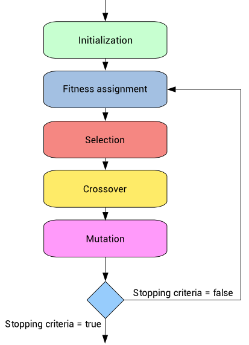

# Genetic-Algorithm
## Introduction
Genetic algorithms operate on a population of individuals to produce better and better approximations.
At each generation, a new population is created by the process of selecting individuals according to their level of fitness 
in the problem domain, and recombining them together using operators borrowed from natural genetics.

## Flow chart for Genetic Algorithm

